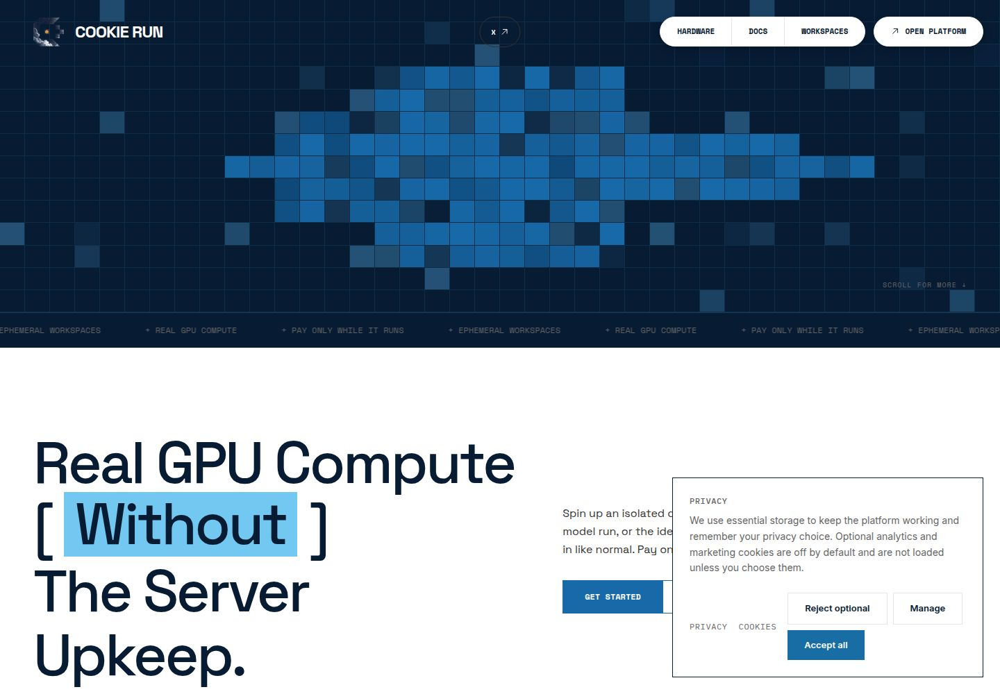
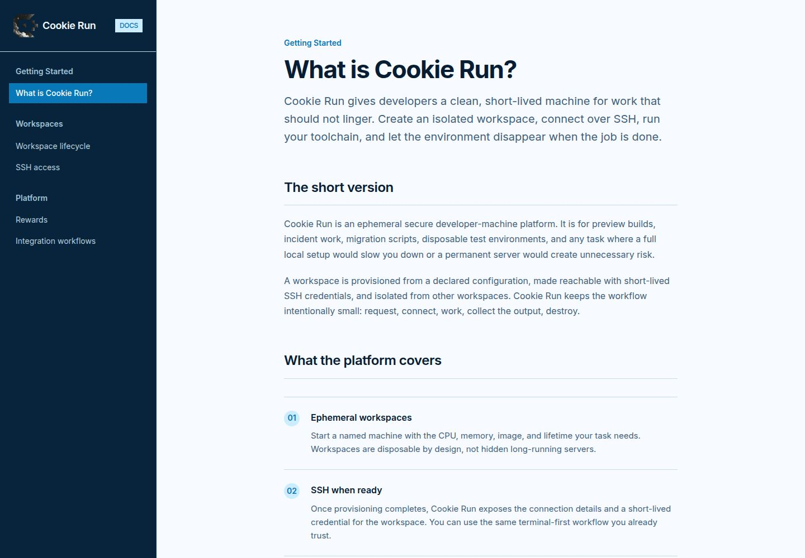
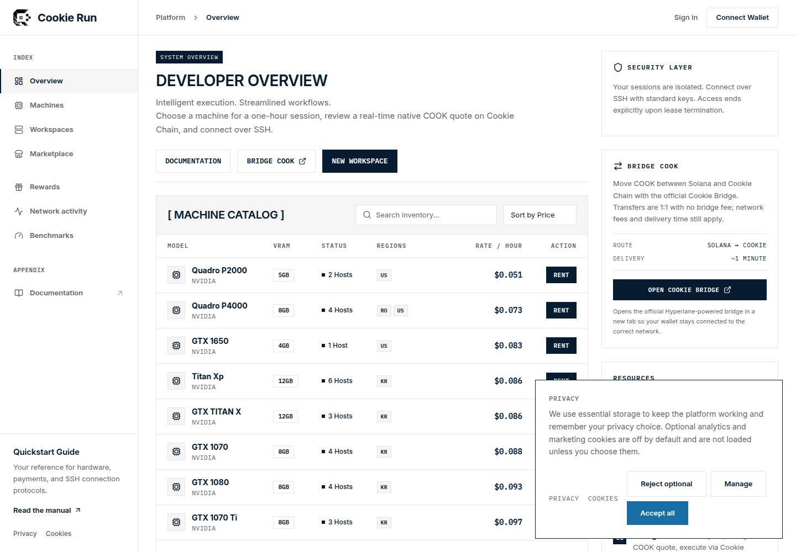

# Cookie Run

Cookie Run is a secure, ephemeral GPU workspace platform. Choose a machine for a build, model run, preview, or migration, connect over SSH, and let the environment disappear when the session ends.

Follow the project on X: https://x.com/0xBasilisca

## Live app

https://cookierun.wtf

## Cookie Chain submission checklist

Cookie Run is built as a Cookie Chain cApp:

- **Wallet:** detects Nightly first and displays the connected wallet address.
- **On-chain interaction:** creates a quoted COOK payment transaction on Cookie Chain.
- **Transaction feedback:** shows wallet approval, broadcast, confirmation, success, timeout, and retry states.
- **Application data:** displays live GPU inventory, rates, availability, workspaces, rewards, and activity.
- **Bridge handoff:** links to the official Cookie Bridge at https://hyperlane.cookiescan.io/.

For a quick verification:

1. Open the live app and select **New Workspace**.
2. Connect Nightly and confirm the wallet address appears.
3. Choose a GPU and keep **COOK** selected as the default payment route.
4. Review the quote, approve the transaction in Nightly, and wait for the confirmation state.
5. Open **Workspaces** to review the resulting lease and its expiry.

## Setup

This repository is a pnpm workspace. Install dependencies and use the app-specific commands below:

```bash
pnpm install
pnpm --filter @workspace/icpx-landing run dev
pnpm --filter @workspace/icpx-docs run dev
pnpm --filter @workspace/api-server run dev
```

The web app expects the API service and the project’s configured database/payment environment when running the full checkout flow. Never commit wallet keys, RPC credentials, provider tokens, or other secrets.

## Why Cookie Chain COOK?

**COOK on Cookie Chain is the cheaper default way to pay for a Cookie Run workspace.**

Cookie Run quotes COOK before checkout and verifies the payment on Cookie Chain before provisioning starts. The default path is designed to keep the rental flow simple and cost-efficient:

- COOK is Cookie Chain’s native asset, so there is no separate application token to acquire for checkout.
- Cookie Chain avoids the premium pricing applied to the mainnet settlement route.
- The quote shows the machine, duration, exchange rate, and total before approval.
- Payment is verified server-side before a machine is started.
- Nightly and compatible Solana wallets can approve the transaction without a custodial account.

Solana mainnet SOL remains available as a separate **premium** payment route. It is useful for users who prefer mainnet settlement, but COOK is the recommended option when the goal is the lowest rental cost.

## What Cookie Run provides

- Browse an ephemeral GPU machine catalog
- Choose a one-hour workspace
- Validate a source or container reference before provisioning
- Connect a wallet and receive a live COOK quote
- Pay with COOK on Cookie Chain or premium SOL on Solana mainnet
- Connect over SSH after the machine is ready
- End the lease and revoke access explicitly
- Review rewards, missions, staking, and network activity

## Screenshots

### Cookie Run landing page



### Cookie Run documentation



### Developer dashboard



## Explore Cookie Run

| Page | What it does |
| --- | --- |
| `/` | Introduces Cookie Run and the secure, short-lived GPU workspace model. |
| `/platform` | Developer dashboard with the machine catalog, live rates, workspace launch, and Cookie Bridge entry point. |
| `/dashboard` | Bookmark-compatible route to the developer dashboard. |
| `/gpus` | Full hardware catalog with GPU specifications and availability. |
| `/marketplace` | Browse and purchase available marketplace offerings. |
| `/workspaces` | Review active and previous workspace rentals, connection details, and expiry. |
| `/rewards` | Sign in with a wallet, earn platform points, complete missions, and view activity. |
| `/stats` | Review platform and network activity. |
| `/benchmarks` | Compare hardware benchmark data. |
| `/docs/` | Read the Cookie Run setup, workflow, security, and SSH documentation. |

## Bridge COOK

The developer dashboard includes a **Bridge COOK** action for moving COOK between Solana and Cookie Chain. It launches the official Hyperlane-powered Cookie Bridge in a new tab, keeping wallet transactions on the verified bridge:

https://hyperlane.cookiescan.io/

The official bridge reports a 1:1 COOK route with no bridge fee. Network fees and delivery time still apply.

## How it works

```text
Choose hardware
      ↓
Validate the workload
      ↓
Review the COOK quote
      ↓
Verify payment on Cookie Chain
      ↓
Provision an isolated machine
      ↓
Connect over SSH
      ↓
Destroy the workspace when finished
```

## Security

- Wallet challenges are short-lived and bound to the signing wallet.
- Payment is verified on the server before provisioning.
- Private source credentials use short-lived opaque references and are not stored with rental records.
- SSH access is exposed only after provisioning.
- Access ends when the lease ends.
- RPC credentials and provider tokens never enter public checkout data.

## Repository layout

```text
apps/web/      Cookie Run web app
apps/docs/     Cookie Run documentation site
services/api/  Workspace lifecycle API
packages/      Shared contracts and database schema
docs/images/   Current product screenshots
```

## Submission links

- Live application: https://cookierun.wtf
- Source code: https://github.com/rociega/cookie-run-platform
- X profile: https://x.com/0xBasilisca
- Cookie Bridge: https://hyperlane.cookiescan.io/

## License

Copyright © 2026 Cookie Run. All rights reserved.