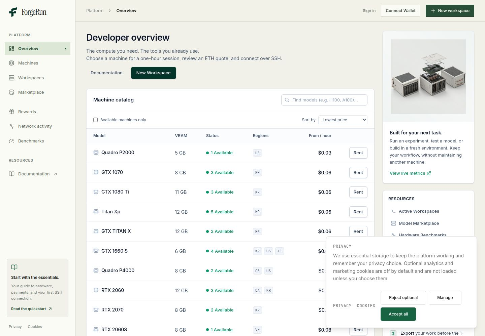
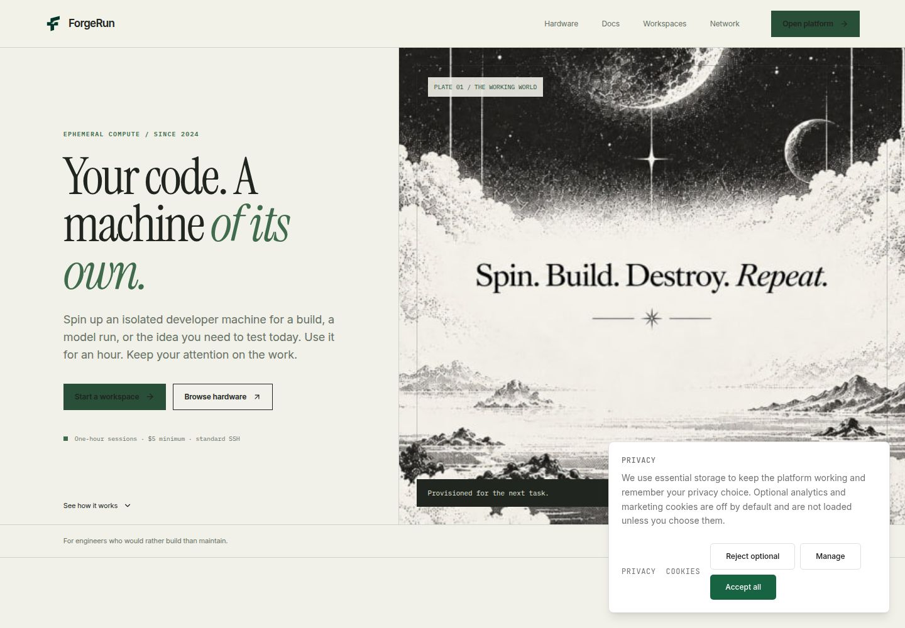

# Cookie Run

Cookie Run is a secure, ephemeral developer-machine platform. Spin up a GPU workspace for a build, model run, preview, or migration, connect over SSH, and let the machine disappear when the session ends.

## Why Cookie Chain

Cookie Run uses native **COOK on Cookie Chain** as its default payment path:

- **Native settlement:** COOK is the chain’s native asset, so users do not need a separate application token to rent a machine.
- **Fast checkout:** quotes are created and verified on Cookie Chain before provisioning begins.
- **Lower operational complexity:** the same chain handles payment confirmation and the platform’s transaction record.
- **Wallet-native access:** Nightly and compatible Solana wallets can sign in and approve the payment without custodial accounts.
- **Transparent pricing:** the UI shows the live COOK quote, the machine rate, the lease duration, and the receiving wallet before confirmation.

Solana mainnet SOL is available as a separate premium payment route for users who prefer mainnet settlement. The two networks are intentionally kept separate so a payment cannot be verified against the wrong RPC or chain.

## What the entry demonstrates

- Public working web application and documentation
- Ephemeral GPU workspace catalog with live machine availability
- One-hour rental flow with source validation and payment gating
- Native COOK payment on Cookie Chain
- Separate SOL payment on Solana mainnet
- Wallet sign-in with signed, expiring challenges
- SSH connection details and explicit workspace teardown
- Rewards, missions, staking, and network activity surfaces
- API/server separation with provider-side payment verification
- Responsive desktop and mobile layouts

## Screenshots

### Developer overview



### Public landing page



### Workspace marketplace


## Architecture

```text
Browser
  ├── Cookie Run landing and workspace UI
  ├── Wallet sign-in and payment approval
  └── SSH connection handoff
          │
          ▼
API server
  ├── Workspace lifecycle and rental state
  ├── Cookie Chain COOK verification
  ├── Solana mainnet SOL verification
  ├── Source validation and credential lifecycle
  └── Rewards and activity APIs
          │
          ├── Cookie Chain RPC
          ├── Solana mainnet RPC
          └── GPU provider
```

## Security model

- Wallet challenges are short-lived and bound to the presented wallet.
- Payment verification is performed server-side before provisioning.
- Private source credentials are represented by short-lived opaque references and are not stored with rental records.
- Workspaces are treated as disposable runtime boundaries.
- SSH access is exposed only after provisioning and is revoked when the lease ends.
- Public checkout never exposes private RPC credentials or provider tokens.

## Local development

Requirements: Node.js 20+, pnpm, and a PostgreSQL database for the API.

```bash
pnpm install
pnpm --filter @workspace/api-server run dev
pnpm --filter @workspace/icpx-landing run dev
```

The application reads runtime configuration from environment variables. Do not commit `.env` files, wallet secrets, RPC credentials, or provider tokens.

## Project layout

```text
artifacts/icpx-landing/  Web application
artifacts/icpx-docs/     Product documentation
artifacts/api-server/    API and workspace lifecycle service
lib/api-zod/             Shared API contracts
lib/db/                  Database schema and access
```

## License

Copyright © 2026 Cookie Run. All rights reserved.